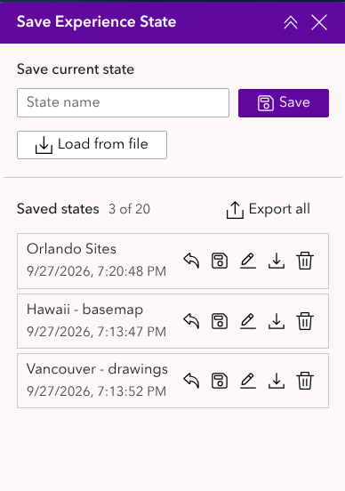

# Save Experience State widget

A custom [ArcGIS Experience Builder](https://developers.arcgis.com/experience-builder/) widget that lets app viewers save where they are in an experience and come back to it later. A saved state includes the page, section views, open window, map viewpoint, layer visibility, basemap and drawings. States can be kept by name in the browser, exported to and loaded from `.json` files, and the last session can be restored automatically when the experience is reopened.

It is a standalone, extended version of Experience Builder's built-in **Experience state** option (*Settings → State & URL parameters → Allow to restore state upon reopening the experience*).

**[Try the live demo](https://mhoyland.github.io/widget-experience/)**



## Features

- **Restore on reopen**: records the last session and, when the experience is opened again, either asks the viewer to restore it (like the built-in banner) or restores it automatically.
- **Named saved states**: save as many named states as you allow. Each one can be restored, replaced with the current state, renamed, downloaded or deleted. Replacing and deleting ask for confirmation first.
- **Export all / load from file**: export every saved state to one `.json` file, with a file name you choose, or download a single state from its row. **Load from file** restores a single-state file straight away, and adds the states of a multi-state file to the list.
- **Drawings from the Draw widget**: saved in exactly the same format as the Draw widget's own *Export drawings* file. If the Draw widget hasn't been opened yet, restored drawings are shown in a **Drawings** map layer and moved into the Draw widget, where they can be edited, as soon as it opens.
- **Basemap**: the basemap of each map is saved and restored. The Basemap Gallery widget highlights the restored basemap.
- **Choose what is saved**: page, section views, window, map viewpoint, layer visibility, basemap and drawings can each be switched off.
- **Handles missing items**: a page, view, window or map that has since been removed from the experience is skipped, and the viewer is told how many items were skipped.

## Requirements

- ArcGIS Experience Builder **Developer Edition**, version 1.21 (the `exbVersion` in `manifest.json`).
- No extra npm packages. The widget only uses the Experience Builder SDK (`jimu-core`, `jimu-arcgis`, `jimu-ui`, `jimu-icons`).

## Installation

1. Copy this folder into your Experience Builder Developer Edition checkout, at:
   ```
   client/your-extensions/widgets/save-experience-state/
   ```
2. Restart the client dev server (`npm start` from `client/`) so it picks up the new widget.
3. In the Experience Builder app designer, add the **Save Experience State** widget from the widget panel. It works with every Map widget in the experience automatically; there's nothing to connect.

## Configuration

In the widget's Setting panel:

| Setting | Default |
|---|---|
| **Allow to restore state upon reopening the experience** | On |
| **When reopened**: ask the user to restore / restore automatically | Ask |
| **Included in state**: page, section views, window, map viewpoint, layer visibility, basemap, drawings | All on |
| **Allow saving named states** / **Maximum saved states** | On / 20 |
| **Allow saving to a .json file** / **Allow loading from a .json file** | On / On |

If you use this widget's *restore on reopen* option, turn off the built-in option in *Settings → State & URL parameters*. Otherwise viewers are asked twice.

## How it works

- **Storage**: saved states and the last session are kept in the browser's IndexedDB (the same storage the built-in experience state, Draw and Add Data use), separately for each experience. They stay in that browser only; use **Export all** and **Load from file** to move states between browsers or share them with other people.
- **Restoring a state** switches to its page, views and window, then updates each map: its active map, basemap, drawings, layer visibility and viewpoint. Restored drawings **replace** the current drawings; a state saved with no drawings clears them.
- **Last session** is recorded about a second after every change: page, view, window, map extent, layers, basemap and drawings.

## Limitations

- The last session is only recorded while the widget is loaded. Put the widget somewhere that loads with the experience, such as the page body or a panel that is open, not inside a widget controller that stays closed.
- Browsers don't guarantee a storage write that starts while the page is closing, so a change made less than a second before closing the tab may not be in the last session.
- Layers added with the Add Data widget aren't saved in the state; Add Data already restores its own layers when the experience is reloaded. Layer visibility is saved for the layers in the web map or web scene only.
- Session recording and restoring are turned off inside the builder, as with the built-in option. In design mode the buttons are disabled; they work in live view and in the published experience.
- Only English translations are included.

## File format

Exported files are plain JSON:

```json
{
  "type": "exb-experience-state",
  "version": 1,
  "appId": "…",
  "exportedAt": "2026-09-27T12:00:00.000Z",
  "states": [
    {
      "id": "state_…",
      "name": "Downtown",
      "createdAt": "…",
      "state": {
        "pageId": "page_1",
        "dialogId": null,
        "viewIds": ["view_2"],
        "maps": {
          "widget_1": {
            "activeDataSourceId": "dataSource_1",
            "viewpoint": { "…": "esri/Viewpoint JSON" },
            "layerVisibility": { "<jimuMapViewId>": { "<jimuLayerViewId>": true } },
            "basemaps": { "<jimuMapViewId>": { "…": "esri/Basemap JSON" } },
            "drawings": { "<jimuMapViewId>": [ { "…": "Draw widget export format" } ] }
          }
        }
      }
    }
  ]
}
```

Each `drawings` array is exactly what the Draw widget's *Export drawings* produces: `Graphic.toJSON()` for each drawing, with `attributes.jimuDrawId` and the measurement label in `attributes.measurementInfos`.

## Development

Tests are in `tests/` and use the Experience Builder SDK's Jest setup. From your `client/` folder:

```
npx jest your-extensions/widgets/save-experience-state
npm run tscheck
```

## License

[MIT](LICENSE)
