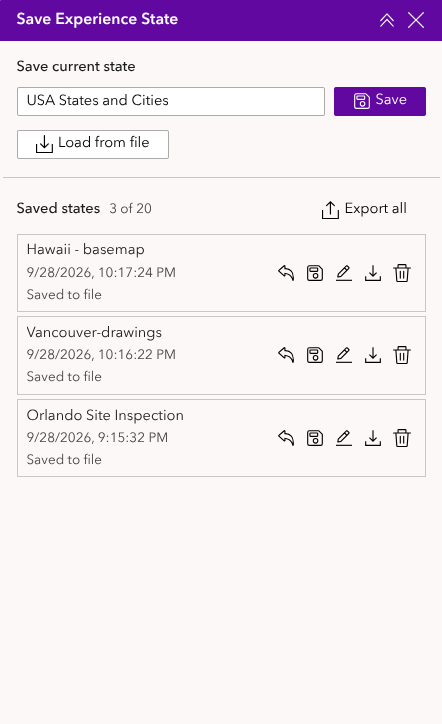
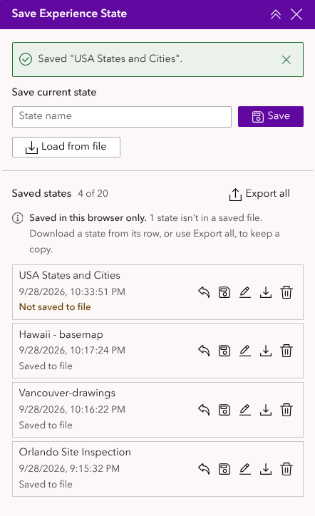
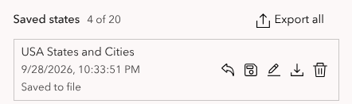
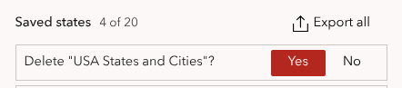
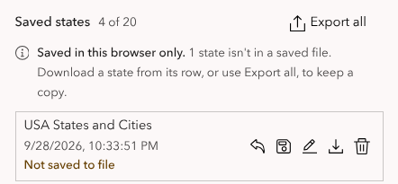
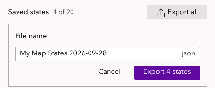
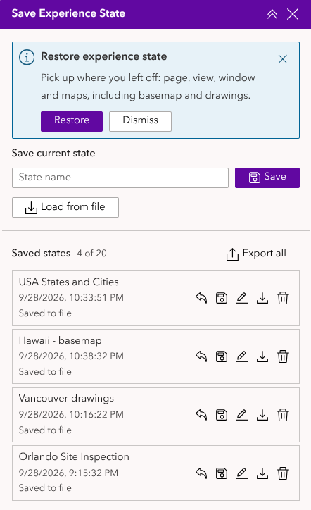
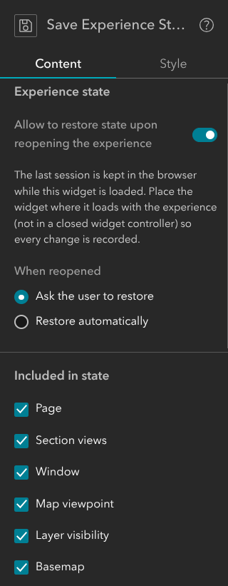
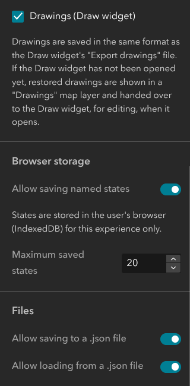

# Save Experience State user guide

Save Experience State lets you save where you are in an ArcGIS Experience Builder app and come back to it later. A saved state remembers the page you're on, the views and window that are open, and for each map: where it's zoomed to, which layers are switched on, the basemap, and any drawings you've made with the Draw widget.

This guide has two parts:

- **[Using Save Experience State](#using-save-experience-state)** is for anyone using an app that includes the widget.
- **[For app authors](#for-app-authors)** is for the person who builds the app.

## Quick start

1. Set the app up the way you want it: go to the page, zoom the map, turn layers on or off, draw.
2. Open **Save Experience State**, type a name such as *Site visit, north block*, and click **Save** (or press **Enter**).
3. Carry on working. Whenever you want to go back, click **Restore** (the curved arrow) next to the name.

## Using Save Experience State

### What a state includes

Depending on how the app is set up, a saved state can include:

| Item | What is saved |
|---|---|
| **Page** | The page you're on. |
| **Section views** | The view showing in each section, for example the second slide of a slideshow. |
| **Window** | The window (pop-up panel) that's open, or that none is open. |
| **Map viewpoint** | Where each map is centred, its zoom or scale, and its rotation. If a map widget can switch between two maps, which one is showing. |
| **Layer visibility** | Which layers of the web map or web scene are switched on. |
| **Basemap** | The basemap of each map. |
| **Drawings** | Everything drawn with the Draw widget, including measurement labels. |

The app's author may have switched some of these off. Anything not included is left as it is when you restore.

### Saving a state

Type a name in the **State name** box and click **Save**, or press **Enter**. If you leave the name empty, the state is named after the current date and time.

A message confirms it, and the new state appears at the top of **Saved states**, with the date and time it was saved. The count beside the heading (for example *3 of 20*) shows how many states you have and how many you can keep.

### Restoring a state

Click **Restore** (the curved arrow) on the state's row. The app goes to the saved page, views and window, then updates each map: its basemap, drawings, layers and finally its viewpoint. A message confirms it, for example *Restored "Site visit, north block".*

**Restoring replaces your current drawings** with the ones in the state. A state saved with no drawings clears the map of drawings. If you want to keep what you've drawn, save it as a state first.

If the Draw widget hasn't been opened yet, the restored drawings appear in a map layer called **Drawings**. As soon as you open the Draw widget, they move into it and you can edit them as normal.

### Managing saved states

Each row in **Saved states** has these buttons:

| Button | What it does |
|---|---|
| **Restore** (curved arrow) | Goes back to this state. |
| **Replace** (disk) | Overwrites this state with how the app is now. Asks *Replace "…" with the current state?* first. |
| **Rename** (pencil) | Lets you type a new name. Press **Enter** to keep it, or **Esc** to cancel. |
| **Save to file** (down arrow) | Downloads this one state as a `.json` file. |
| **Delete** (bin) | Removes the state. Asks *Delete "…"?* first. |

To answer a *Replace* or *Delete* question, click **Yes** or **No**. **Esc** also means No.

### Where your states are kept

**Saved states are kept in this browser only.** They aren't saved to the app, so:

- you won't see them on another computer, or in another browser on the same computer;
- they're lost if you clear your browser's data (cookies and site data);
- other people using the app can't see them.

To keep a copy, move states to another computer or share them with someone, save them to a file (see the next section).

Under each state's date, a tag reminds you which states need saving to a file:

| Tag | Meaning |
|---|---|
| *Not saved to file* | Saved in this browser and never saved to a file. |
| *Unsaved changes* | Saved to a file before, but renamed or replaced since. |
| *Saved to file* | Matches the last file you saved it to, or loaded it from. |

While any state isn't in a saved file, a note under the **Saved states** heading says how many, for example *Saved in this browser only. 2 states aren't in a saved file. Download a state from its row, or use Export all, to keep a copy.* **Save to file** on a row saves one state; **Export all** saves them all at once.

The tags only appear when the app lets you save to a file. They know that a file was downloaded, not where you kept it, so a state stays *Saved to file* even if you later delete the file.

### Saving states to a file

- **One state:** click **Save to file** (the down arrow) on its row.
- **All states:** click **Export all** beside the **Saved states** heading. A **File name** box appears, filled in with the app's title and today's date, for example *Harbour plan states 2026-09-28*. Change it if you like, then click **Export 3 states** (or press **Enter**). **Cancel** or **Esc** closes the box without saving.

The file downloads to your computer. It's a small `.json` file you can keep, email or put on a shared drive.

### Loading states from a file

Click **Load from file** and choose a `.json` file saved by this widget.

- **A file with one state** is restored straight away, and also added to your saved states.
- **A file with several states** (from **Export all**) adds them all to your saved states, without restoring any. Click **Restore** on the one you want. If the app doesn't keep a list of saved states, it can only load a file with one state.

States loaded from a file are tagged *Saved to file*.

If the file was saved from a different app, you'll see *This file was saved from a different experience.* Anything that exists in both apps, such as a map with the same layers, is still restored; the rest is skipped.

### Picking up where you left off

If the app is set up to remember your last session, the widget records how the app is about a second after each change. The next time you open the app in this browser, one of two things happens:

- **You're asked.** A **Restore experience state** message appears in the widget. Click **Restore** to go back to where you were, or **Dismiss** to start fresh.
- **It's automatic.** The app goes straight back to where you were, and the widget shows *Restored your last session.*

If the app opens with a splash window, it's closed when your session is restored.

The last session is separate from your saved states. It's replaced every time you use the app, so to keep a particular setup, save it as a named state.

## For app authors

This part explains how to add Save Experience State to an app in Experience Builder (Developer Edition).

### Adding the widget to an app

1. In the builder, drag **Save Experience State** from the widget panel into your app.
2. There's nothing to connect: it works with every Map widget in the app automatically.
3. Choose its settings (below), then save and publish the app.

**Where to put it:** the last session is only recorded while the widget is loaded. If you use **Allow to restore state upon reopening the experience**, put the widget somewhere that loads with the app, such as on the page or in a sidebar panel that starts open, and not in a widget controller that starts closed.

While you're designing the app, the widget's buttons are disabled and it shows *Saving and restoring states is available in live view and in the published experience.* Switch to **Live view**, or open the published app, to try it.

### Settings

#### Experience state

- **Allow to restore state upon reopening the experience** (on by default): records the viewer's last session and offers it back next time (see [Picking up where you left off](#picking-up-where-you-left-off)).
- **When reopened**: **Ask the user to restore** (default) shows a message with **Restore** and **Dismiss**; **Restore automatically** restores without asking.

This does the same job as Experience Builder's built-in option under *Settings → State & URL parameters → Allow to restore state upon reopening the experience*, but also restores basemaps and drawings. **If you use this one, turn the built-in one off**, or viewers will be asked twice.

#### Included in state

Tick the items saved in each state: **Page**, **Section views**, **Window**, **Map viewpoint**, **Layer visibility**, **Basemap** and **Drawings (Draw widget)**. All are ticked by default. These apply to named states, files and the last session alike.

Untick an item to leave it alone when states are restored. For example, untick **Map viewpoint** so that viewers can save which layers are on without the map jumping to another place.

#### Browser storage

- **Allow saving named states** (on by default): shows the name box, **Save** and the **Saved states** list.
- **Maximum saved states** (default 20, up to 200): how many states each viewer can keep. When the list is full, the viewer must delete one before saving another, or before loading a file.

#### Files

- **Allow saving to a .json file** (on by default): shows **Export all**, the per-row **Save to file** button, and the tags that show which states are in a saved file. If named states are off, a **Save to file** button appears next to the name box instead, so viewers can still keep a state.
- **Allow loading from a .json file** (on by default): shows **Load from file**.

### What isn't saved

- **Layers added with the Add Data widget.** Add Data restores its own layers when the app is reopened. Only the layers in the web map or web scene have their visibility saved.
- **Selections, filters, pop-ups and widget settings**, such as the features selected in a table or the options chosen in a query.
- **Anything in the last second before the tab is closed.** Browsers don't guarantee storage writes that start while a page is closing.

## Messages and troubleshooting

| You see | What it means / what to do |
|---|---|
| The buttons are greyed out, with *Saving and restoring states is available in live view…* | You're in the builder. Switch to Live view or open the published app. |
| *No features are enabled. Configure this widget in the builder.* | The author has switched off all of the widget's options. |
| *State restored. 2 item(s) no longer exist in this experience and were skipped.* | The app has changed since the state was saved: a page, view, window or map in the state has been removed. Everything else was restored. |
| *You can save up to 20 states. Delete a state before saving a new one.* | The list is full. Delete a state (save it to a file first if you want to keep it). A file with more states than there's room for isn't loaded at all. |
| *Could not save to browser storage. It may be full or disabled.* | The browser won't store data for this site, for example in some private windows or when site data is blocked. Save to a file instead. |
| *The file is not valid JSON.* / *The file is not an experience state file.* | The file wasn't made by this widget, or has been edited. Choose another file. |
| *The file was created by a newer version of this widget.* | Ask the app's author to update the widget. |
| *The file does not contain any states.* | The file was exported from an empty list. |
| *This file contains 3 states. This app can only load a file with one state.* | The file came from **Export all**, but this app doesn't keep a list of saved states. Ask for a file of just the state you need (saved with **Save to file**). |
| *This file was saved from a different experience…* | The states were loaded, but anything that doesn't exist in this app was skipped. |
| A state shows *Not saved to file* although I exported it earlier | States saved before the tags were added to the widget have no record of their file. Save them to a file once more. |
| My saved states have gone | They're kept in the browser, and the browser data was cleared, or you're on another browser or computer. Load them from a saved file. |
| My drawings disappeared after restoring | Restoring replaces the current drawings with the state's. To avoid it, save a state before restoring another; you can then restore it to get your drawings back. |
| Drawings appear in a *Drawings* layer, not in the Draw widget | The Draw widget hasn't been opened yet. Open it and the drawings move into it. |
| The app didn't go back to my last session | The widget wasn't loaded during your last visit (for example it's in a closed widget controller), or the change was made just before closing the tab. |
